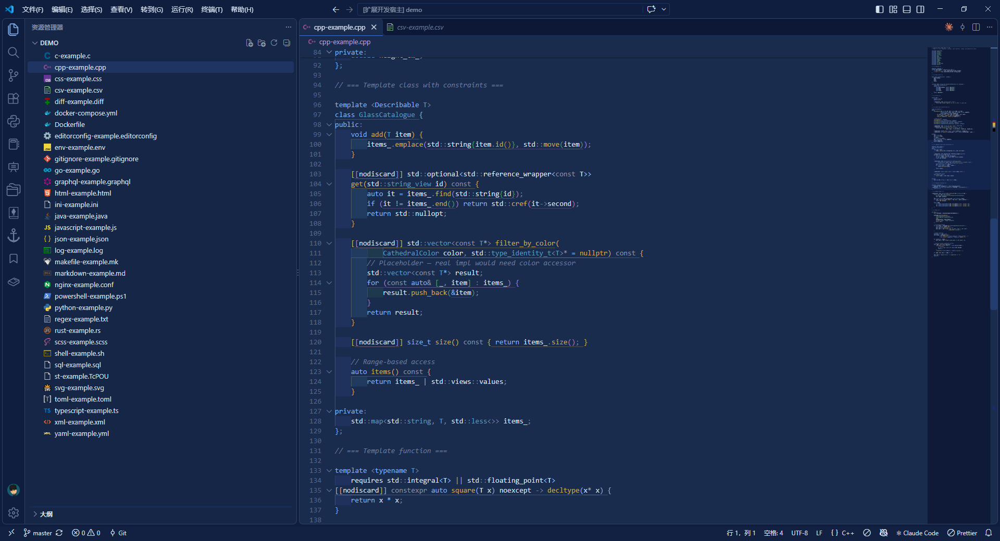
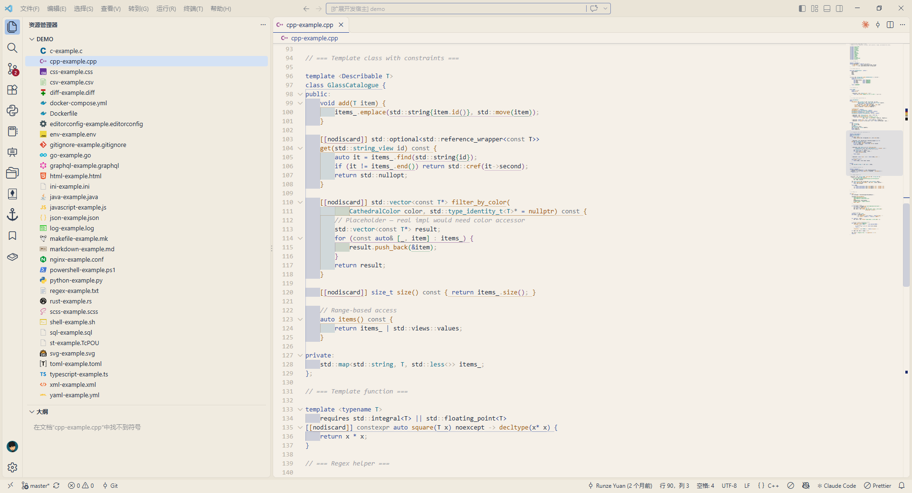

# Chartres Blue Cathedral Theme

A VS Code color theme inspired by the stained glass of Chartres Cathedral — a dark and a light theme built around its legendary cobalt blue.

## Themes

- **Chartres Blue Dark** — a dark theme anchored on cobalt blue, with low-contrast warm accents for long coding sessions
- **Chartres Blue Light** — a light theme on warm parchment white, with jewel-toned syntax highlighting in the manner of an illuminated manuscript

## Screenshots

**Chartres Blue Dark**



**Chartres Blue Light**



## Install

Search **Chartres Blue Cathedral Theme** in the VS Code Extensions view, or install from the command line:

```bash
code --install-extension Vehshanaan.chartres-blue-theme-vscode
```

You can also install it straight from the [VS Code Marketplace](https://marketplace.visualstudio.com/items?itemName=Vehshanaan.chartres-blue-theme-vscode).

## Usage

After installing, pick a theme via `Preferences: Color Theme` (`Ctrl+K Ctrl+T`):

- `Chartres Blue Dark`
- `Chartres Blue Light`

## Development

```bash
# Clone the repository
git clone https://github.com/Vehshanaan/chartres-blue-theme.git
cd chartres-blue-theme

# Open in VS Code and press F5 to launch the Extension Development Host
```

## License

MIT © 2025 Vehshanaan

---

# 沙特尔蓝大教堂主题

一套灵感来源于沙特尔大教堂（Chartres Cathedral）彩绘玻璃标志性钴蓝色的 VS Code 主题，包含深色与浅色两套。

## 主题

- **Chartres Blue Dark** — 深色主题，以钴蓝为主色调，低对比度的暖色点缀，适合长时间编码
- **Chartres Blue Light** — 浅色主题，以羊皮纸暖白为底色，宝石色调的语法高亮，如同泥金手抄本

## 截图

**Chartres Blue Dark**


**Chartres Blue Light**


## 安装

在 VS Code 扩展面板搜索 **Chartres Blue Cathedral Theme**，或通过命令行安装：

```bash
code --install-extension Vehshanaan.chartres-blue-theme-vscode
```

也可以从 [VS Code Marketplace](https://marketplace.visualstudio.com/items?itemName=Vehshanaan.chartres-blue-theme-vscode) 直接安装。

## 使用

安装后通过 `Preferences: Color Theme`（`Ctrl+K Ctrl+T`）选择：

- `Chartres Blue Dark`
- `Chartres Blue Light`

## 开发

```bash
# 克隆仓库
git clone https://github.com/Vehshanaan/chartres-blue-theme.git
cd chartres-blue-theme

# 在 VS Code 中打开，按 F5 启动 Extension Development Host 预览
```

## 许可证

MIT © 2025 Vehshanaan
